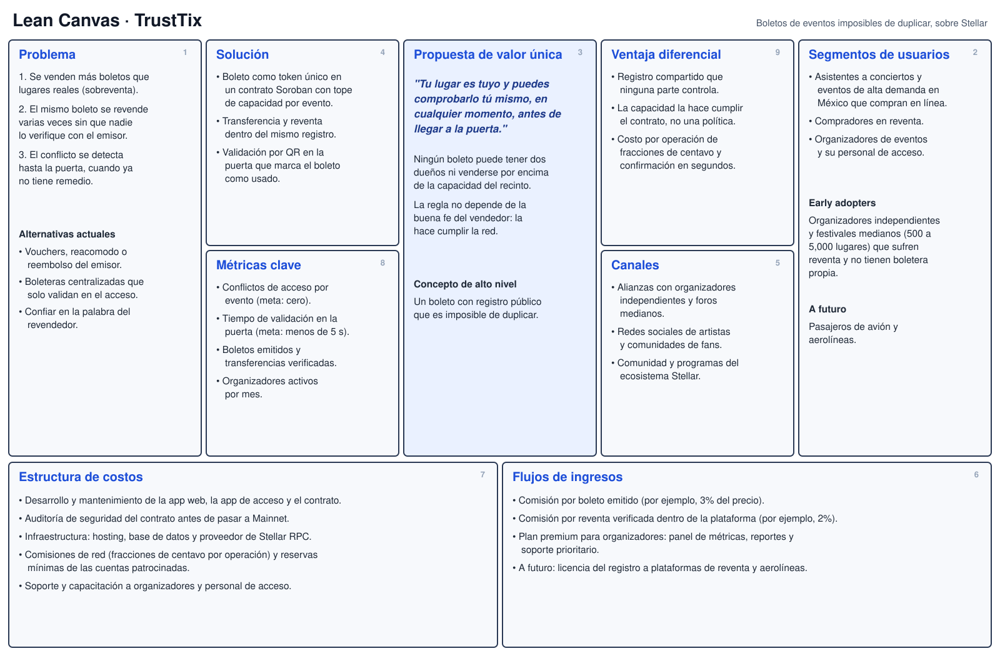
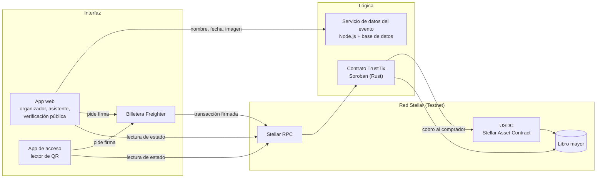

# Product Blueprint

**Nombre del proyecto:** TrustTix

**Repositorio (enlace obligatorio):** [Builders101](https://github.com/DanielRosalesAlanis/Builders101)

---

## Contenido

1. Priorización de historias
2. Propuesta de valor
3. Flujo de usuario
4. Alcance del MVP
5. Lean Canvas
6. Backlog priorizado (Kanban)
7. Arquitectura inicial
8. Uso de Stellar y justificación

---

## 1. Priorización de historias

> Historias elegidas entre las que propuso el equipo y criterio con que se priorizaron. Son las que pasan al backlog. Extensión: breve.

**Criterio de priorización:** Usamos MoSCoW (imprescindible / debería / podría / queda fuera) evaluando cada historia con tres preguntas: ¿ataca directamente alguna de las tres fricciones del Problem Brief, en especial la detección tardía del conflicto?, ¿es necesaria para completar el recorrido crear evento, comprar, transferir y entrar?, y ¿es viable en Stellar Testnet dentro del tiempo del curso? Las historias repetidas entre integrantes se fusionaron en una sola.

| Prioridad | Historia | Propuesta por | Por qué entra al backlog |
| :---: | --- | :---: | --- |
| 1 | Como organizador de eventos quiero definir la capacidad máxima del recinto al crear el evento para que el sistema impida vender más boletos que lugares disponibles. | Daniel | Imprescindible. Elimina la sobreventa en el origen (fricción 1). |
| 2 | Como asistente a un concierto quiero comprar un boleto que quede registrado a mi nombre como único dueño para tener la certeza de que nadie más puede reclamar mi lugar. | Daniel (fusionada con la historia 1 de David) | Imprescindible. Es el núcleo de la hipótesis: un lugar, un dueño verificable. |
| 3 | Como asistente quiero conectar mi billetera digital con un solo clic para comprar y guardar mi boleto sin pasos técnicos complicados. | David | Imprescindible. Sin billetera no hay forma de ser dueño del boleto en la red. |
| 4 | Como comprador quiero pagar mi boleto con una moneda estable digital para no exponerme a cambios de precio entre la compra y la confirmación. | David (fusionada con la historia 3 de Andrea) | Imprescindible. Sin pago la compra no es real, y el organizador recibe el dinero directo. |
| 5 | Como personal de acceso quiero escanear el código QR del boleto y obtener una respuesta de válido o inválido en pocos segundos para no generar filas en la entrada. | Daniel | Imprescindible. Es el punto donde hoy se descubre el conflicto (fricción 3). |
| 6 | Como personal de acceso quiero que un boleto quede marcado como usado en el momento en que la persona entra para que no pueda volver a usarse con una captura de pantalla. | David | Imprescindible. Sin esta marca, un boleto único podría entrar dos veces. |
| 7 | Como asistente quiero transferir mi boleto a otra persona desde la aplicación para regalarlo o venderlo sin que pierda la garantía de ser válido. | Gael | Imprescindible. La reventa existe; si ocurre dentro del registro, nunca hay dos dueños (fricción 2). |
| 8 | Como comprador en reventa quiero confirmar que el boleto pertenece al vendedor y que no ha sido usado antes de pagar para no ser víctima de una reventa duplicada. | Daniel (fusionada con la historia 2 de Gael) | Debería. Protege al comprador secundario con una consulta de solo lectura. |
| 9 | Como asistente quiero verificar en cualquier momento la validez de mi boleto desde mi celular para no descubrir un problema hasta llegar a la puerta. | Daniel | Debería. Materializa la promesa de "comprobarlo yo mismo" con bajo costo de desarrollo. |
| 10 | Como asistente quiero que mi boleto muestre un código QR que cambie cada pocos segundos para que nadie pueda copiarlo y usarlo en mi lugar. | Andrea | Podría. Refuerza la seguridad en la puerta, pero la marca de usado ya cubre el riesgo principal. |
| 11 | Como organizador de eventos quiero consultar en un panel cuántos boletos se han vendido, transferido y usado para tomar decisiones de operación en tiempo real. | David | Podría. Útil para el organizador, pero no resuelve el problema del asistente. |

**Quedan fuera del backlog por ahora:** registro con correo o huella sin billetera (Andrea), reembolso automático por cancelación (Andrea), verificación sin conexión (Andrea), precio máximo de reventa (Gael), notificaciones de cambio de estado (Gael), consulta para la autoridad de protección al consumidor (Gael), interfaz pública para plataformas de reventa (David) y los dos casos de aerolíneas (Daniel y Andrea).

---

## 2. Propuesta de valor

> Qué resultado obtiene el usuario y por qué elegiría esta solución. En qué se diferencia de cómo resuelve hoy. Conecta con el usuario del Problem Brief. Extensión: 150 a 300 palabras en total.

**Usuario (del Problem Brief):** La persona que compra de forma legítima un boleto para un concierto o evento de alta demanda, en venta oficial o en reventa, y necesita la certeza de que su lugar le pertenece solo a ella. Empezamos por eventos; el pasajero de avión queda como segundo segmento.

**Resultado que obtiene:** Un boleto imposible de duplicar cuya validez puede comprobar por sí misma, en cualquier momento, desde su celular. Si el boleto aparece a su nombre en TrustTix, ese lugar es suyo: el organizador no puede vender más lugares que la capacidad registrada y nadie puede vender el mismo boleto dos veces.

**Por qué elegiría esta solución:** Le quita el miedo a llegar a la puerta y quedarse fuera. Comprar se siente como en cualquier boletera, pero la garantía no depende de la buena fe de la plataforma: la regla de capacidad y la unicidad de cada boleto están escritas en un contrato que ninguna de las partes puede cambiar a conveniencia. Si compra en reventa, ve antes de pagar que el boleto es real, que pertenece al vendedor y que no ha sido usado.

**En qué se diferencia de cómo lo resuelve hoy:** Hoy la validez del boleto vive en la base de datos privada del emisor y solo se comprueba en el acceso, cuando ya es tarde (fricción 3 del Problem Brief). Las plataformas de reventa no consultan esa base, y cuando hay conflicto la respuesta es un voucher o un reembolso que no devuelve la experiencia perdida. TrustTix mueve la verificación al momento de la compra y de la transferencia, y la abre a todos los actores sobre un mismo registro compartido. El conflicto deja de detectarse tarde porque deja de poder ocurrir.

---

## 3. Flujo de usuario

> Recorrido de la persona por la solución de principio a fin, roles y puntos de interacción. Diagrama o secuencia numerada. Extensión: 150 a 300 palabras.

Roles: **Organizador**, **Asistente** (comprador original), **Comprador en reventa** y **Personal de acceso**.

| Paso | Rol | Qué hace | Punto de interacción |
| :---: | :---: | --- | --- |
| 1 | Organizador | Crea el evento con nombre, fecha, precio y capacidad máxima, y autoriza las cuentas de su personal de acceso. | Panel del organizador, billetera, red |
| 2 | Asistente | Abre la página del evento y conecta su billetera. | Pantalla del evento, billetera |
| 3 | Asistente | Compra el boleto: paga en USDC y el contrato emite un boleto único a su cuenta en la misma operación. Si ya no hay lugares, la compra se rechaza. | Billetera (firma), red |
| 4 | Asistente | Revisa "Mis boletos" y ve el estado de cada uno (válido o usado) leído directamente de la red. | Pantalla Mis boletos, red (lectura) |
| 5 | Asistente | Si no puede asistir, transfiere el boleto a la cuenta de otra persona. | Pantalla de transferencia, billetera, red |
| 6 | Comprador en reventa | Antes de pagarle al vendedor, busca el número de boleto y confirma quién es el dueño y que no ha sido usado. | Pantalla de verificación pública, red (lectura) |
| 7 | Asistente o nuevo dueño | El día del evento abre su boleto y muestra el código QR. | Pantalla del boleto |
| 8 | Personal de acceso | Escanea el QR y la app confirma dueño y estado en segundos. | App de acceso (cámara), red (lectura) |
| 9 | Personal de acceso | Si es válido, registra la entrada y el boleto queda marcado como usado. Un segundo escaneo del mismo boleto se rechaza. | App de acceso, red |

---

## 4. Alcance del MVP

> Funcionalidad central separada de la deseable que queda fuera. Justificación de por qué el recorte sigue entregando valor. Extensión: 150 a 300 palabras en total.

| Dentro del MVP (funcionalidad central) | Fuera del MVP (deseable, para después) |
| --- | --- |
| Creación de eventos con capacidad máxima fijada en el contrato. | Registro con correo o huella (passkeys) sin instalar billetera. |
| Conexión de billetera Freighter en Stellar Testnet. | QR dinámico que cambia cada pocos segundos. |
| Compra con pago en USDC de prueba y emisión del boleto en la misma transacción. | Precio máximo de reventa y regalías para el organizador. |
| Vista "Mis boletos" con el estado leído de la red. | Reembolso automático si el evento se cancela. |
| Transferencia de boletos entre cuentas. | Panel de métricas del organizador y notificaciones. |
| Verificación pública de un boleto antes de comprarlo en reventa. | Verificación en la puerta sin conexión a internet. |
| App de acceso: escaneo de QR, validación y marcado como usado. | Boletos de avión y compensación por denegación de embarque. |

**Por qué el recorte sigue entregando valor:** El MVP cubre de punta a punta el recorrido crear evento, comprar, transferir y entrar, que es justo donde ocurren las tres fricciones del Problem Brief. Con él ya es imposible vender por encima de la capacidad, revender el mismo boleto dos veces o entrar dos veces con el mismo boleto, y cualquiera puede comprobarlo sin pedir permiso al emisor. Lo que dejamos fuera mejora la comodidad (passkeys, notificaciones), agrega reglas de negocio (tope de reventa, reembolsos) o abre otro mercado (aerolíneas), pero ninguna de esas piezas es necesaria para demostrar la hipótesis central. Dejar aviones para después también evita depender de la normativa aérea y de sistemas de reservación que no controlamos. Usar Testnet nos permite validar el flujo con usuarios reales sin mover dinero real.

---

## 5. Lean Canvas

> Lienzo de una página con el modelo del producto. Extensión: enlace (obligatorio).

**Enlace al Lean Canvas (obligatorio):** [Lean Canvas del proyecto](https://github.com/DanielRosalesAlanis/Builders101/blob/main/docs/semana2/assets/LeanCanvas.svg)

El lienzo cubre problema, segmento de usuarios, propuesta de valor única, solución, canales, métricas clave, ventaja diferencial y estructura de costos e ingresos.

---

## 6. Backlog priorizado (Kanban)

> Enlace al tablero en GitHub Projects, construido con las historias priorizadas, en columnas y con criterios de aceptación por tarjeta. Extensión: enlace al tablero (obligatorio).

**Enlace al tablero (obligatorio):** [Tablero Kanban en GitHub Projects](https://github.com/users/DanielRosalesAlanis/projects/1)

El tablero tiene las columnas **Backlog**, **Ready** (listas para trabajar), **In progress**, **In review** y **Done**. Las historias imprescindibles y las que deberían entrar empiezan en Ready; las que podrían entrar empiezan en Backlog. Cada tarjeta incluye su prioridad, su categoría MoSCoW, su responsable y sus criterios de aceptación.

Las tarjetas se asignaron según los roles definidos en el Problem Brief:

| Integrante | Rol | Tarjetas a cargo |
| --- | --- | --- |
| Daniel Rosales Alanis | Coordinación / entregas | P7 Transferir boleto, P9 Verificar mi boleto. Además mueve el tablero e integra las piezas. |
| David Eliaquim Diaz Hernandez | Developer | P1 Crear evento con capacidad, P2 Comprar boleto, P4 Pagar con USDC, P6 Marcar como usado (contrato Soroban). |
| Gael Damián Hernández Carranza | Documentación | P8 Verificación pública, P11 Panel del organizador. Además revisa los criterios de aceptación antes de pasar una tarjeta a Done. |
| Laura Andrea Basurto Ocampo | Desarrollo de producto | P3 Conectar billetera, P5 Escanear QR en la puerta, P10 QR dinámico. |

---

## 7. Arquitectura inicial

> Cómo se conectan las partes (interfaz, lógica, Stellar) y en qué punto entra la red. Diagrama simple en imagen. Extensión: 150 a 300 palabras en total.

**Diagrama (imagen o enlace):**

| Capa | Componente | Qué hace |
| :---: | --- | --- |
| Interfaz | App web (React) con Stellar Wallets Kit y app de acceso con lector de QR. | Muestra eventos y boletos, pide la firma de la billetera y escanea los QR en la puerta. |
| Lógica | Contrato TrustTix en Soroban y un servicio ligero en Node.js. | El contrato guarda la capacidad de cada evento, emite, transfiere y marca boletos como usados. El servicio solo guarda datos descriptivos del evento, nunca quién es dueño de qué. |
| Stellar | Stellar RPC, USDC mediante Stellar Asset Contract y el libro mayor de Testnet. | Recibe las transacciones, ejecuta el contrato, mueve el pago y deja el registro inalterable. |

**En qué punto entra la red:** En cinco momentos. Escribe en la red cuando el organizador crea el evento, cuando el asistente compra (pago y emisión ocurren en una sola transacción: o pasan las dos o ninguna), cuando se transfiere un boleto y cuando el personal de acceso registra la entrada. Lee de la red cada vez que alguien consulta el dueño o el estado de un boleto, lo cual no cuesta comisión. Todo lo que define la validez de un boleto vive en la red; fuera de ella solo quedan la interfaz y los datos descriptivos del evento.

---

## 8. Uso de Stellar y justificación

> Qué componentes de Stellar usaría y por qué cada uno. Apoyado en el criterio de pertinencia del Problem Brief. Extensión: 150 a 300 palabras en total.

**Criterio de pertinencia (del Problem Brief):** Varias partes que no confían entre sí (organizador, plataformas de reventa y personal de acceso) necesitan escribir y consultar un mismo registro, y queremos eliminar al emisor como único custodio de la validez de cada boleto.

| Componente de Stellar | Para qué lo usamos | Por qué ese y no otra alternativa |
| --- | --- | --- |
| Contratos inteligentes Soroban | Guardar la capacidad de cada evento, emitir boletos únicos, transferirlos y marcarlos como usados. | Las reglas "no más boletos que lugares" y "un boleto, un dueño" las hace cumplir la red, no el emisor. Un activo clásico de Stellar sirve para representar valor, pero no permite expresar capacidad por evento ni el estado de usado. |
| Cuentas Stellar y billetera Freighter (vía Stellar Wallets Kit) | Identificar al dueño de cada boleto y firmar compras, transferencias y entradas. | La propiedad se demuestra con la firma de la persona. Una cuenta custodiada por nosotros volvería a concentrar la confianza en un intermediario. |
| USDC mediante Stellar Asset Contract | Cobrar el boleto y pagar al organizador en la misma transacción que emite el boleto. | Precio estable frente a XLM, y al ser invocable desde el contrato el pago y la emisión son atómicos. |
| Stellar RPC | Consultar dueño y estado desde la app, la verificación pública y la app de acceso. | Las lecturas son gratuitas y cualquiera puede hacerlas sin pedir permiso al emisor, que es justo lo que pide el criterio de pertinencia. |
| Red de prueba (Testnet) | Desarrollar y demostrar el MVP. | Permite probar con usuarios reales sin dinero real. |

Además, la confirmación en unos 5 segundos y las comisiones de fracciones de centavo hacen viable escribir en la red en la puerta del evento sin generar filas ni encarecer el boleto.
